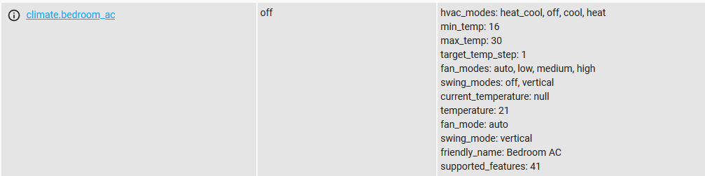

# Control Gree AC using ESPHome and IRremoteESP8266 - EXAMPLE

**IR remote** - Avatto S06

* Create file "gree_ir.h" in folder "config\esphome\gree", where "config" is HA configuration folder.
* Edit your ".yaml" file like "ir_bedroom.yaml".

**UART:**
* port 3v3 of the device to the 3v3 of the converter.
* port TXD of the device to the RXD of the converter.
* port RXD of the device to the TXD of the converter.
* port GND of the device to the GND of the converter.
* port IO0 of the device to the GND of the converter.

**Flash** using ESPHome-Flasher https://github.com/esphome/esphome-flasher/releases. First flash with UART, other flashes on air.

**Result:**




**Service esphome.ir_bedroom_set_data** - set all data to AC with one 'beep':

```
- service: esphome.ir_bedroom_set_data
  data:
    hvac: 'cool'
    temp: 22
    fan: 'auto'
    swing: 'off'
    light: True
```

**Sensor binary_sensor.bedroom_ac_light** - current AC light state.